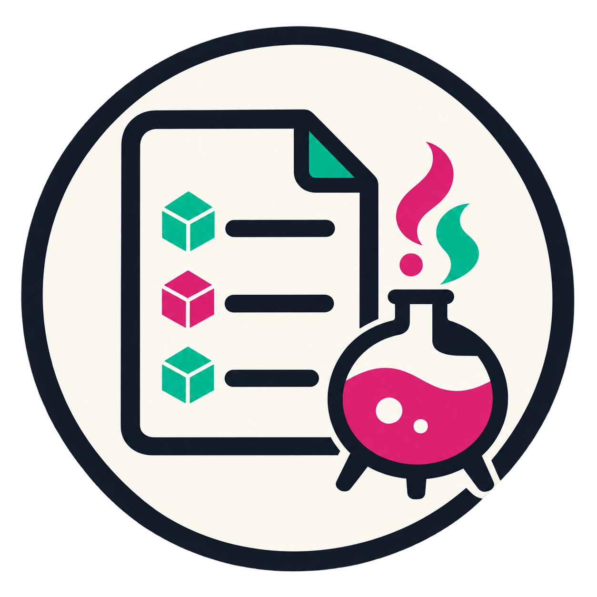

# `brewgen`

<p align="center">
  
</p>

<p align="center">
  <a href="https://github.com/tanaabased/brewgen/releases"></a>
  
</p>

`brewgen` is a hosted Bash script that turns the current Homebrew state into a focused Brewfile.
Select package types, exclude exact packages, choose an output path, and keep the result under
version control without hauling a full machine bootstrapper into the room.

> Supports Bash on macOS with Homebrew and `brew bundle` available. CI covers macOS 26.

## Overview

At a high level, `brewgen`:

- reads installed Homebrew taps, casks, formulae, and supported package-manager sections
- writes a Brewfile to the current directory or a selected output path
- filters exact package names and supports one or more selected package types
- refuses to overwrite an existing Brewfile unless explicitly allowed

## Quickstart

Generate the default Brewfile from the hosted script:

```sh
/bin/bash -c "$(curl -fsSL https://brewgen.tanaab.sh/brewgen.sh)" brewgen
```

Set inputs inline when you want to make the generated output explicit:

```sh
/bin/bash -c "$(curl -fsSL https://brewgen.tanaab.sh/brewgen.sh)" brewgen \
  --package-type tap \
  --package-type brew \
  --brewfile ./Brewfile.work \
  --force
```

## Usage

For repeated use, install the hosted script as a local command in a directory you manage on
`PATH`:

```sh
mkdir -p "$HOME/.local/bin"
curl -fsSL https://brewgen.tanaab.sh/brewgen.sh -o "$HOME/.local/bin/brewgen"
chmod +x "$HOME/.local/bin/brewgen"

brewgen --help
```

Run it with flags when you want to keep the selected behavior visible:

```sh
brewgen --brewfile ./Brewfile.work --force
brewgen --package-type tap --package-type brew
brewgen --exclude codex --exclude visual-studio-code
BREWGEN_DEBUG=1 brewgen --package-type cask
```

Common inputs:

| Option           | Environment variable    | Description                                                                       |
| ---------------- | ----------------------- | --------------------------------------------------------------------------------- |
| `--brewfile`     | `BREWGEN_BREWFILE`      | Output Brewfile path.                                                             |
| `--package-type` | `BREWGEN_PACKAGE_TYPES` | Comma-separated default package types; repeat the option to select more than one. |
| `--exclude`      | `BREWGEN_EXCLUDE`       | Comma-separated exact package names to omit.                                      |
| `--force`        | `BREWGEN_FORCE`         | Allow an existing output file to be overwritten.                                  |
| `--debug`        | `BREWGEN_DEBUG`         | Emit diagnostic output.                                                           |

Supported package types are `tap`, `brew` (or `formula`), `cask`, `mas`, `vscode`, `go`, `cargo`,
`uv`, and `flatpak`. CLI options override environment values, which override built-in defaults.
Run `brewgen --help` for the complete current contract.

## Development

This repository uses Bun for tooling and publishes a Netlify-ready `dist/` directory:

```sh
git clone https://github.com/tanaabased/brewgen.git
cd brewgen
bun install
bun run lint
```

`bun run build` and the Leia examples are CI-owned by default: the build regenerates tracked
distribution files, and examples exercise Homebrew on fresh macOS runners.

## Issues, Questions and Support

Use the [GitHub issue queue](https://github.com/tanaabased/brewgen/issues) for bugs, regressions,
or feature requests.

## Changelog

See [`CHANGELOG.md`](./CHANGELOG.md) for release history and
[GitHub releases](https://github.com/tanaabased/brewgen/releases) for published artifacts.

## Maintainers

- [@pirog](https://github.com/pirog)

## Contributors

<a href="https://github.com/tanaabased/brewgen/graphs/contributors">
  
</a>

Made with [contrib.rocks](https://contrib.rocks).
